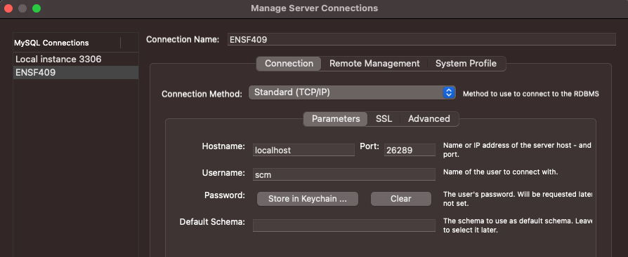

        

# Reinventorii


This project creates a platform for employees at the University of Calgary to manage their furniture. By using this advanced Supply Chain Management software, the university will be able to prevent reusable materials from entering the landfill and thus preventing waste.

Check out our demonstration video on [YouTube](https://youtu.be/KbdvFVaVgr0)

### Built With

- [Spring Boot](https://spring.io/projects/spring-boot)
- [Ionic React](https://ionicframework.com)
- [Docker](https://www.docker.com)

### Software Architecture

[Detailed in `docs/UML.md`](docs/UML.md)

## Getting Started

### Using Docker (recommended)

#### Prerequisites

Ensure that you have Docker and `docker-compose` installed on your development computer: [Docker website](https://www.docker.com). Windows computers will need to use WSL2 (Windows Subsystem for Linux) as a backend following [this guide](https://docs.docker.com/docker-for-windows/wsl/).

The MySQL server is hosted within the container. When running the container the server will automatically create a database based on the `inventory.sql` file located in the `db` folder. You can also connect to the server from your machine using the port `26289`. The default username is `scm` and password is `ensf409`.

**MySQL Database Login Information**
| paramater | value |
|----------------|---------------------------------|
| database url | localhost:26289/INVENTORY |
| username | scm |
| password | ensf409 |

#### Installation

```bash
# Clone this repo
git clone https://github.com/March-27-Hackathon/supply-chain-management-RatikKapoor.git
cd supply-chain-management-RatikKapoor

# Start the production React app, start the Java backend, start a clean MySQL Server
./run

# *** Note: Windows users using command prompt (as opposed to powershell or git bash) can simply use the `run`
# command within the root directory

# *** Note: if `./run` does not work you can start the production environment using the following command ***
docker-compose up --build --force-recreate
```

_**NOTE:** Since this process is creating **all** React, Java, and MySQL containers, it may take 2-3 minutes to fully build (depending on your computer specs, Windows machines will be slower). Once building is finished, browse to [http://localhost:5000](http://localhost:5000) to view the application._

To quit the production environment, simply press Ctrl+C and the Docker containers will shut down.

#### Connecting with MySQL workbench

The docker container that's hosting the MySQL server has it's port exposed on port `26289`. To connect simply use the credentials shown in the database login information table above. Example:



#### Using a new database

To use a new database in the production app, simply replace the `db/inventory.sql` file. Please keep the original file for testing purposes as tests expect the `inventory.sql` that comes with this repo.

### Manual method (not recommended)

#### Prerequisites

Ensure that you have the standard Node.js development tools available to use and the Yarn Package Manager installed globally as well as Java JDK 11.

A MySQL server must also be running on your machine or remotely. To set up the database run the `inventory.sql` file located in the `db` folder. Enter the appropriate login credentials into the `.env` folder.

- [Java 11 SDK](https://www.oracle.com/ca-en/java/technologies/javase-jdk11-downloads.html)
- [Node.js](https://nodejs.org/en/)
- [Yarn](https://yarnpkg.com)
- [Ionic CLI](https://ionicframework.com/docs/cli)
- [Node Serve](https://www.npmjs.com/package/serve)
- [MySQL](https://dev.mysql.com/downloads/mysql/)

#### Installation

To run this repository locally:

```bash
# Clone this repo
git clone https://github.com/March-27-Hackathon/supply-chain-management-RatikKapoor.git
cd supply-chain-management-RatikKapoor

# Start Maven project
./mvnw spring-boot:run

# Start the Node server (in another terminal)
cd frontend
yarn install
yarn build
serve -s build
```

## Testing

The same prerequisites as the "Getting Started" section are required.

### Using Docker (Recommended)

**Note:** once the tests have completed the MySQL server will be shut down with the rest of the container. If you wish to interact with the MySQL server use the Development or Run instructions.

The unit testing environment for this project has also been dockerized. Just like `./run`, testing will use the `db/inventory.sql` file and spawn a clean database. Please ensure you are using the correct `inventory.sql` file for testing, as tests have been coded to expect the file that comes with this repo.

```bash
# Run all tests contained in src/test/**
./test

# *** Note: Windows users using command prompt (as opposed to powershell or git bash) can simply use the `test`
# command within the root directory

# *** Note: if `./test` does not work you can start the production environment using the following command ***
docker-compose -f docker-compose.test.yml up --build --abort-on-container-exit --force-recreate
```

### Manual Method (Not Recommended)

To test this repository locally:

A MySQL server must also be running on your machine or remotely. To set up the database run the `inventory.sql` file located in the `db` folder. Enter the appropriate login credentials into the `.env` folder.

```bash
# Run Maven tests
./mvnw clean test
```

## Development

Details for developing can be found in [`docs/DEVELOPMENT.md`](docs/DEVELOPMENT.md)

## Contributing

Currently, pull requests should be limited to the contributors part of the university project. Please use semantic commit messages and branch naming conventions using [this guide](https://www.conventionalcommits.org/en/v1.0.0/). Private branches should be named using the `semantic/name/purpose` convention. For example: `docs/ratik/update-readme` signifies that Ratik is responsible for this documentation change and the purpose of the branch is to update the README. For major changes, please open an issue first to discuss what you would like to change. Please base all pull requests off of the main branch as they will be rebase merged. Before opening a pull request: check that there are no testing issues by running `./test`. The linear history requirement is enforced on main.

Please make sure to update tests as appropriate.

## License

[MIT](https://choosealicense.com/licenses/mit/)
